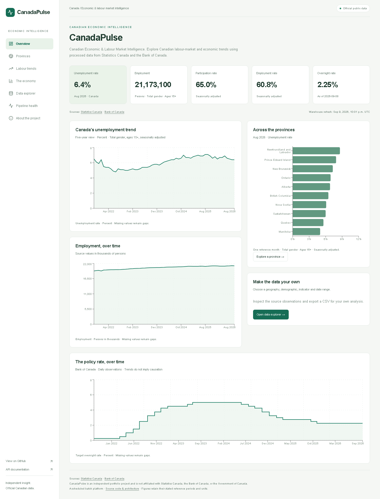
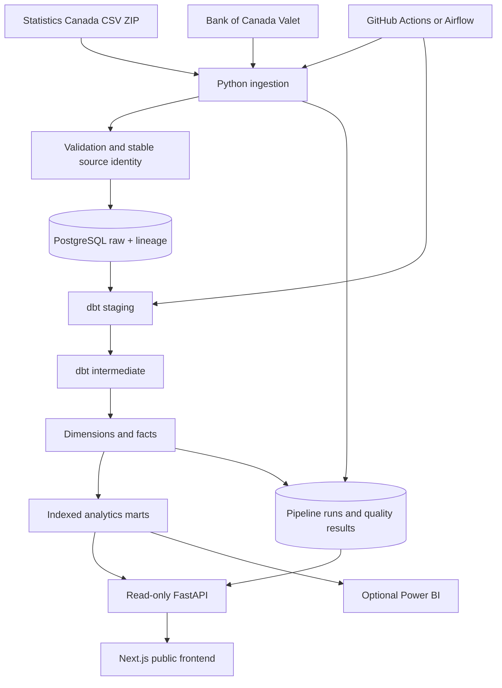

# CanadaPulse

### Canadian Economic & Labour Market Intelligence Platform

[](pyproject.toml)
[](https://github.com/sarbzcode/CanadaPulse/actions/workflows/ci.yml)
[](https://github.com/sarbzcode/CanadaPulse/actions/workflows/dbt-ci.yml)
[](https://github.com/sarbzcode/CanadaPulse/actions/workflows/frontend-ci.yml)
[](LICENSE)

CanadaPulse turns official Canadian labour-market and interest-rate observations into a tested
analytical warehouse and an interactive web application. Python handles source revisions and
lineage; PostgreSQL and dbt model the data; FastAPI serves curated metrics; Next.js makes them
explorable. Pipeline status and data-quality results are derived from actual executions.

**[Architecture](#architecture) · [Data model](docs/data-model.md) · [Deployment](docs/deployment.md) · [Engineering decisions](docs/decisions/) · [GitHub](https://github.com/sarbzcode/CanadaPulse)**



## Overview

This is a scheduled/batch data engineering portfolio project built by a Computer Science
student. It demonstrates extraction, validation, atomic source loading, revision handling,
dimensional modelling, analytical SQL, testable orchestration, APIs, and user-facing analytics.
It makes no claims of real-time ingestion, guaranteed uptime, or distributed-scale necessity.

## Live Demo

**READY FOR DEPLOYMENT.** The website and API run locally; no public hosted URL is currently
verified. Neon-compatible PostgreSQL configuration, a Render API blueprint, and a Vercel-ready
Next.js application are included. Add real demo/API URLs only after platform setup and checks
in [deployment.md](docs/deployment.md) succeed.

Local website: http://localhost:3000 · Local API docs: http://127.0.0.1:8000/docs

## Why CanadaPulse?

Economic data is easy to download and easy to misinterpret. Different demographic groups,
seasonal adjustments, units, reference periods, and revisions can produce misleading joins or
charts. CanadaPulse preserves those distinctions and makes the transformation and refresh
history inspectable. Employers can explore the data and inspect how it arrived there.

## Architecture



## Features

- Official CSV/API ingestion with streaming parsing, retries and bounded socket timeouts.
- Atomic per-source COPY/upsert loads, deterministic identities, source payloads and lineage.
- Separate counts for inserted, revised and unchanged observations; nulls remain null.
- dbt staging/intermediate models, star schema, serving marts and meaningful data tests.
- Calendar-aware MoM/YoY changes, consistent headline scope and explicit rate alignment.
- Typed versioned APIs with bounded filters, read-only queries and sanitized failures.
- Seven website pages, interactive charts, province comparison, CSV export and pipeline health.
- Python, dbt and frontend CI; guarded scheduled refresh; optional Airflow orchestration.
- Hosted PostgreSQL/SSL, configured CORS, Docker and deployment documentation.
- Optional real-data PySpark/Parquet demonstration, outside the core runtime.

## Technology Stack

| Layer | Technology and reason |
|---|---|
| Ingestion | Python, urllib, psycopg; source clients and PostgreSQL COPY/upsert |
| Storage | PostgreSQL 16; relational integrity, JSON lineage, query indexes |
| Transformation | dbt Core/Postgres; SQL models, dependency graph, assertions and docs |
| API | FastAPI/Pydantic; typed, documented, read-only contracts |
| Website | Next.js, TypeScript, Tailwind CSS, Recharts, SWR |
| Automation | GitHub Actions for inexpensive scheduling/CI; Airflow for task orchestration |
| Optional analytics | Power BI model guide; PySpark DataFrames and partitioned Parquet |
| Deployment | Docker; hosted PostgreSQL, Render and Vercel configuration |

## Data Sources

- [Statistics Canada table 14-10-0287](https://www150.statcan.gc.ca/t1/tbl1/en/tv.action?pid=1410028701): monthly labour observations. The configured display slice references the full `14100287` ZIP; the loader keeps Estimate observations across available demographics and adjustments.
- [Bank of Canada Valet API](https://www.bankofcanada.ca/valet/docs): series `V39079`, the business-daily target overnight rate.

Default history begins January 2015. Coverage and record counts are measured at runtime,
not embedded as marketing constants. Geographies are derived from observed data; metadata
for provinces/territories is seeded, but missing territorial observations are not fabricated.

CanadaPulse is independent and is not affiliated with Statistics Canada, the Bank of Canada,
or the Government of Canada.

## Data Pipeline

```bash
python -m canadapulse.cli refresh
```

The command initializes additive SQL, imports both sources, builds/tests dbt, and records
warehouse quality results. Source imports can also run independently:

```bash
python -m canadapulse.cli ingest --source boc
python -m canadapulse.cli ingest --source statcan --start-date 2015-01-01
python -m canadapulse.cli warehouse
```

A normal import downloads fresh data. `--reuse-cache` is explicit offline replay and must not
be used for scheduled production freshness. Narrowing a start date does not delete older data.
Source rows absent from later downloads are retained; revision history is not archived.
[Detailed semantics](docs/pipeline.md).

## Data Warehouse

The warehouse contains staging/intermediate views, deterministic dimensions, revision-safe
facts and materialized serving tables. Full rebuilds capture source revisions at the current
data size. No raw payloads are sent to the public browser.

Headline marts use total gender, age 15+, seasonally adjusted estimates. Employment counts
are persons; the explorer preserves published units such as persons in thousands. Percentages
are not summed. MoM uses calendar-checked LAG; YoY uses the exact prior-year month.

## Data Model

| Models | Purpose |
|---|---|
| dim_date, dim_geography, dim_indicator, dim_series | Stable date and descriptive keys |
| fact_labour_market | Full-table PID × reference month × vector × coordinate; complete demographic/adjustment grain |
| fact_interest_rates | Date × official series |
| labour_observations, interest_rate_history | Full-detail, indexed serving marts |
| province_labour_summary, canada_labour_trends | Consistent headline measures and changes |
| province_comparison | Comparable monthly provincial metrics |
| economic_dashboard | Monthly labour with last observed rate within that month |

See [grains, keys, ER diagram and units](docs/data-model.md). Economic alignment describes
trends; it does not imply a causal relationship between rates and labour outcomes.

## API

Open `/docs` or `/redoc` on the API host. Public routes query curated dbt models:

| Route | Purpose |
|---|---|
| `/health` | Safe database/pipeline readiness details |
| `/api/v1/provinces` | Observed geography metadata, including Canada |
| `/api/v1/indicators` | Source indicator names, units and descriptions |
| `/api/v1/filters` | Available demographic and adjustment values |
| `/api/v1/labour/latest` | Latest headline measures for one geography |
| `/api/v1/labour/history` | One demographic series with dates and pagination |
| `/api/v1/labour/compare` | Same-month provincial headline comparison |
| `/api/v1/economy/interest-rates` | Daily official rate history |
| `/api/v1/dashboard/summary` | Canada KPIs with separate source/reference dates |
| `/api/v1/pipeline/status` | Actual source/warehouse freshness and quality |
| `/api/v1/pipeline/runs` | Safe execution history and observed load counts |

Original `/api/labour`, `/api/rates`, `/api/filters`, `/api/comparison`, `/api/runs` and
`/api/health` routes remain for compatibility. The original HTML dashboard remains at the
API root. That MVP reads the legacy raw-derived views; the public website uses the dbt API.

## Public Dashboard

- **Overview:** Canada headline indicators, labour trends, province comparison and policy rates.
- **Provinces:** selected geography KPIs, YoY employment change and comparable history.
- **Trends:** indicator/geography/date controls with an optional comparison series.
- **Economy:** business-daily overnight-rate history with explicit frequency/correlation caveats.
- **Explore:** gender, age, adjustment and date filters; chart, paginated table and CSV export.
- **Pipeline:** actual freshness, run outcomes, loaded/revised counts and quality assertions.
- **About:** sources, architecture and engineering decisions.

The homepage revalidates every five minutes. Interactive data requests are bounded and cached
in the browser. All pages handle loading, no-data and unavailable-service states. No Redis or
browser-side raw-table download is needed.

## Data Quality

Validation rejects malformed dates, invalid numerics, changed source structure and empty
selected responses. Raw uniqueness constraints prevent uncontrolled duplicates. dbt tests
verify documented grain, foreign-key relationships, non-null/unique keys, rate bounds, monthly
dates, source/fact reconciliation, headline grain and economic date alignment.

Missing/suppressed labour values remain null. Their measured rate is informational; suppression
is not automatically a validation failure. Test counts shown on the website come from actual
dbt run results and recorded source checks.

## Pipeline Observability

`metadata.pipeline_runs` records execution status, counts, timings, reference coverage and
private failure details. `metadata.data_quality_results` stores measured checks. Public APIs
exclude error traces, connection information and raw payloads. Legacy runs may have no new
insert/revision metrics; those fields display as unavailable rather than fabricated zeros.

Source freshness and reference-period recency are different. The pipeline is degraded if a
required source is missing, stale, failed, or still running. A successful source import is not
a successful warehouse refresh until dbt completes. See [orchestration](docs/orchestration.md).

## Testing

```bash
python -m ruff check .
python -m pytest -q
# PostgreSQL integration tests create/drop an isolated temporary test database:
# PowerShell: $env:CANADAPULSE_INTEGRATION='1'
# bash: export CANADAPULSE_INTEGRATION=1
python -m pytest tests/integration -q
cd frontend
npm ci
npm run lint
npm run typecheck
npm run build
```

CI never depends on live government APIs. dbt CI builds a disposable database from guarded
synthetic fixtures and checks actual unit conversion, MoM/YoY and API semantics. These fixture
values never populate the public database. See [verification ledger](docs/milestones.md).

## Local Setup

Use Python 3.11–3.13 for the complete dbt environment, Node 22+, and Docker.

```powershell
py -3.13 -m venv .venv
.venv/Scripts/Activate.ps1
python -m pip install -e '.[dev,warehouse]'
if (!(Test-Path .env)) { Copy-Item .env.example .env }
docker compose up -d postgres
python -m canadapulse.cli refresh
python -m canadapulse.cli serve
```

In a second terminal:

```powershell
cd frontend
Copy-Item .env.example .env.local
npm ci
npm run dev
```

Open http://localhost:3000. API docs: http://127.0.0.1:8000/docs.
On Linux/macOS use `python3 -m venv .venv` and `source .venv/bin/activate`.
Do not overwrite an existing private .env. The first full refresh can take several minutes.

## Docker

`docker compose up -d postgres` starts PostgreSQL on host port 55432. The optional app profile
builds the API: `docker compose --profile app up --build`. Initialize/load the database before
serving the versioned endpoints. The image runs as a non-root user and honors the platform's
PORT. The Airflow profile is documented separately and binds its authenticated UI to localhost.

## dbt

```bash
python -m canadapulse.services.warehouse_service deps
python -m canadapulse.services.warehouse_service debug
python -m canadapulse.services.warehouse_service seed
python -m canadapulse.services.warehouse_service run
python -m canadapulse.services.warehouse_service test
python -m canadapulse.services.warehouse_service docs generate
python -m canadapulse.services.warehouse_service docs serve
```

The wrapper exports the validated database settings without credentials in command arguments.
Direct dbt commands also work with the environment-based profile. Use the `warehouse` CLI
command for a **tracked** build/test. See [warehouse guide](docs/warehouse.md).

## Deployment

[Deployment guide](docs/deployment.md): hosted PostgreSQL/SSL, reader/writer roles, Render,
Vercel, CORS, GitHub secrets, health checks and honest deployment status. The scheduled workflow
is opt-in through ENABLE_PRODUCTION_REFRESH and a private production DATABASE_URL.

## Project Structure

```text
src/canadapulse/  Ingestion, configuration, database, validation, API and services
sql/init/        Repeatable raw/metadata schema initialization
warehouse/       dbt sources, staging, intermediate, dimensions, facts, marts, tests
frontend/        Next.js/TypeScript website
scripts/         CI fixtures, scheduling and streaming Spark export
tests/           Unit and isolated PostgreSQL integration coverage
.github/         Python, dbt, frontend and scheduled workflow definitions
airflow/         Optional Linux orchestration image and DAG
spark/           Optional local/Databricks-ready DataFrame job
docs/            Architecture, modelling, deployment, decisions and real screenshots
```

## Engineering Decisions

Preserved the working ingestion and local dashboard instead of rebuilding them. Added dbt
alongside the old views, then introduced versioned API contracts for the public site. Chose
full model rebuilds over premature incremental complexity, deterministic keys, explicit units,
and alternative schedulers rather than two simultaneous production schedules.
[Decision records](docs/decisions/).

## Screenshots

Captured from the working local website using the real loaded warehouse:

[Overview](docs/screenshots/overview.png) · [Data explorer](docs/screenshots/explorer.png) ·
[Pipeline status](docs/screenshots/pipeline.png) · [Mobile](docs/screenshots/mobile.png)

Screenshots are point-in-time examples, not promises that the source values remain current.

## Roadmap

- Complete external hosting/account setup and add verified public URLs.
- Run and observe scheduled production refreshes; tune storage/query costs using measurements.
- Optional [Power BI reports](docs/power-bi.md); no fabricated PBIX deliverable.
- Optional [Spark demonstration](docs/spark.md) and [Azure/Databricks architecture](docs/cloud-architecture.md).
- Add historical revision archiving or atomic multi-model publication only when justified.

## License

MIT. See [LICENSE](LICENSE). Source data remains subject to the respective providers' terms.
