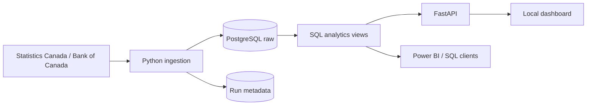

# CanadaPulse

A local Canadian economic data platform with public-source ingestion, PostgreSQL analytics
views, a read-only FastAPI backend, and an interactive dashboard.

## Run it

Use Python 3.11+ and Docker. Run these commands from the repository root:

```powershell
# Only copy the example if you do not already have a .env file.
if (!(Test-Path .env)) { Copy-Item .env.example .env }
python -m pip install -r requirements.txt -r requirements-dev.txt
docker compose up -d postgres
python -m canadapulse.cli ingest
python -m canadapulse.cli serve
```

Open **http://127.0.0.1:8000** for the dashboard or **http://127.0.0.1:8000/docs** for
interactive API documentation. The server binds to localhost. Docker starts PostgreSQL;
the Python server runs separately.

The first ingestion downloads the Statistics Canada full-table ZIP (about 60 MB at the
initial verified run), streams its CSV, and loads selected observations. Allow several
minutes for the initial load. Analytics only sees each source after its transaction commits.

## What is implemented

- Bank of Canada Valet ingestion for configured series `V39079` (target overnight rate).
- Statistics Canada full-table `14100287` CSV ingestion, retaining monthly `Estimate`
  observations, all available geographies, genders, ages, and adjustment categories.
- Default coverage starts January 2015. Change it with `--start-date YYYY-MM-DD`.
- Streaming CSV parsing, PostgreSQL COPY staging, and atomic upserts that apply revisions.
- Source payloads, units, suppression flags, stable identities, timestamps, and run lineage.
- Three download attempts with timeouts; per-source locks prevent overlapping imports.
- Persistent run status, observed counts, duration, and errors.
- Analytics views and filtered API endpoints for labour and interest-rate exploration.
- Dashboard filters, time-series charts, observation table, CSV export, and run history.



## Refresh data

```powershell
python -m canadapulse.cli ingest
python -m canadapulse.cli ingest --source boc
python -m canadapulse.cli ingest --source statcan --start-date 2020-01-01
```

Each normal run downloads fresh source data and reconciles revisions in the requested range.
Earlier observations already loaded are retained. `--start-date` is a load boundary, not a
request to delete older data. Statistics Canada monthly dates use the first day of the month.
The raw table is a current-observation store, not a history of every source revision.

For offline replay of an existing download:

```powershell
python -m canadapulse.cli ingest --reuse-cache
```

Caches live in ignored `data/cache/`; cache reuse is explicit and does not check freshness.
No automatic scheduler is installed. To schedule refreshes, configure Windows Task Scheduler
with your Python executable, arguments `-m canadapulse.cli ingest`, and **Start in** set to
this repository directory. Airflow orchestration remains future work.

## Database and API

PostgreSQL uses host port `55432` by default. Settings come from process environment variables,
then `.env`, then defaults. Keep `.env` private.

| Object | Purpose |
|---|---|
| `raw.bank_of_canada_observations` | Daily rate observations, keyed by date and series |
| `raw.statcan_labour_force` | Monthly observations with complete source dimensions |
| `metadata.pipeline_runs` | Pipeline execution history |
| `analytics.labour_market` | Dashboard labour observations with explicit dimensions |
| `analytics.interest_rates` | Daily rate observations |

`python -m canadapulse.cli init-db` applies repeatable additive SQL to an existing database.
Ingestion runs this automatically; restarting a Docker volume is not required for migrations.

| Route | Purpose |
|---|---|
| `/` | Interactive dashboard |
| `/api/health` | Database connectivity |
| `/api/filters` | Available labour dimensions and coverage |
| `/api/labour` | One selected labour series with date filters and pagination |
| `/api/rates` | Daily interest rates with date filters and pagination |
| `/api/runs` | Latest 20 pipeline runs |
| `/api/comparison` | Same-month labour comparison across geographies |

The dashboard includes province comparisons (click a bar to switch geography), chart
inspection on hover or touch, 1-year/5-year date shortcuts, month-over-month changes,
searchable and paginated observations, date sorting, and CSV export. Filter selections
are saved in the page URL, so a bookmarked view can be reopened. Additional gender,
age, and seasonal-adjustment controls are under **More filters**. Changes to rate
indicators are shown in percentage points; other changes retain source units.

Labour requires an exact geography, indicator, gender, age group, and adjustment combination.
Defaults select Canada's unemployment rate, total gender, ages 15+, seasonally adjusted.
Some filter combinations have no source observations; the dashboard shows an empty state.
API limits are at most 5,000 labour rows or 20,000 rate rows per request; use `offset` for
additional pages. Queries use parameterized filters and read-only transactions.

Values retain original source units: `Persons in thousands` must not be read as individual
persons. Missing or suppressed observations remain null, never zero. The dashboard does not
sum rates, mix adjustment types, or join daily rates to monthly labour dates.

## Verification

```powershell
python -m pytest -q
python -m ruff check .
# Optional real PostgreSQL tests: creates and removes an isolated temporary test database.
$env:CANADAPULSE_INTEGRATION = '1'
python -m pytest tests/integration -q
```

Integration tests require database-creation privileges and verify reruns, source revisions,
rollback on malformed observations, metadata, missing values, and API filtering. They do not
modify project observations or require live source downloads.

## Code map

- `src/canadapulse/cli.py`: ingestion, initialization, status, and server commands.
- `src/canadapulse/ingestion/pipelines.py`: source retrieval, parsing, validation, COPY/upsert.
- `src/canadapulse/database/`: connections, SQL execution, and run tracking.
- `src/canadapulse/api/app.py`: read-only query endpoints.
- `src/canadapulse/api/dashboard.html`: self-contained browser explorer, without a CDN.
- `config/`: public dataset and series configuration.
- `sql/init/`: raw contracts, operational schemas, and analytics views.
- `tests/`: unit tests and optional isolated PostgreSQL integration test.

This is currently a repository-based editable-install application. dbt star schemas, Airflow,
Spark, cloud deployment, and a Power BI report remain future extensions; their directories
are placeholders. SQL views provide the current working analytics layer.

## Sources

- [Statistics Canada Web Data Service](https://www.statcan.gc.ca/en/developers/wds)
- [Statistics Canada table 14-10-0287](https://www150.statcan.gc.ca/t1/tbl1/en/tv.action?pid=1410028701)
- [Bank of Canada Valet API](https://www.bankofcanada.ca/valet/docs)

MIT licensed. See LICENSE.
