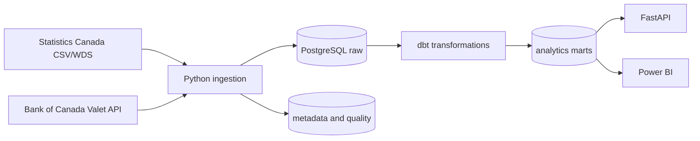

# CanadaPulse

[](https://www.python.org/)
[](LICENSE)

An automated Canadian economic and labour-market data platform that ingests public
government data, validates and transforms it into analytical warehouse models, and exposes
curated metrics through APIs and BI-ready datasets.

## Current Status

CanadaPulse is being built phase by phase. The repository currently contains the Phase 1
foundation: Python package structure, local PostgreSQL infrastructure, metadata schema,
configuration, structured logging, lint/test configuration, and starter documentation.

No pipeline metrics or data record counts are claimed until ingestion runs successfully
against real sources.

## Why CanadaPulse?

CanadaPulse is designed as a production-style portfolio project for data engineering,
analytics engineering, BI, platform, and backend roles. It focuses on how public data moves
from source systems into a reliable analytical warehouse, rather than on notebook-only
analysis.

## Architecture



## Features

- Local PostgreSQL service with dedicated `raw`, `staging`, `intermediate`, `analytics`,
  and `metadata` schemas.
- Metadata table for pipeline lifecycle, row counts, runtime, status, and errors.
- Environment-driven settings with redacted CLI output.
- Structured JSON logging for jobs and containers.
- Raw table contracts for Statistics Canada labour-force observations and Bank of Canada
  observations.
- Pytest and ruff configuration for repeatable local quality checks.

## Technology Stack

- Python 3.11+
- PostgreSQL 16
- Docker Compose
- pytest
- ruff

Planned phases add dbt, Apache Airflow, FastAPI, PySpark, and CI workflows.

## Data Sources

- Statistics Canada table `14-10-0287-03`, distributed as full-table CSV ZIP data.
- Bank of Canada Valet API series `V39079`, target overnight rate observations.

Source configuration lives in `config/datasets.yml` and `config/series.yml`.

## Quick Start

```powershell
Copy-Item .env.example .env
python -m pip install -r requirements.txt -r requirements-dev.txt
docker compose up -d postgres
python -m canadapulse.cli status
python -m pytest
python -m ruff check .
```

For systems with `make` available:

```bash
make setup
make up
make status
make test
make lint
```

## Local Development

The application reads `.env` automatically when present. Secrets and local credentials must
stay out of Git; `.env` is ignored and `.env.example` contains only local dummy values.
PostgreSQL is exposed on host port `55432` by default to avoid collisions with a native
PostgreSQL install on `5432`.

Useful commands:

```bash
python -m canadapulse.cli config
python -m canadapulse.cli status
docker compose logs -f postgres
docker compose down
```

## Data Model

The first database migration creates the operational schemas. The second migration creates
`metadata.pipeline_runs`. The third migration defines raw-source table contracts.

The analytical warehouse models will be added in the dbt phase. See
[`docs/data-model.md`](docs/data-model.md) for the current modelling contract and planned
star schema.

## Pipeline

Python ingestion will write to `raw` and `metadata`. dbt will own staging, intermediate,
and analytics transformations. Airflow will orchestrate reusable application functions
rather than embedding business logic in DAG files.

## API

FastAPI will be added after ingestion and dbt models are runnable. Planned endpoints include
health, province lookup, labour history, latest labour metrics, interest rates, and a
dashboard summary.

## Data Quality

The metadata schema records pipeline status, observed row counts, rejected rows, errors, and
runtime. Future phases will add source-specific validation checks and data-quality result
tables.

## Testing

Current tests cover configuration loading, redaction, structured logging, CLI output, and
metadata count validation. External HTTP calls and live database work are intentionally not
required for unit tests.

## Project Structure

```text
config/              Source configuration
sql/init/            PostgreSQL initialization SQL
src/canadapulse/     Application package
tests/               Unit and integration tests
docs/                Architecture and engineering documentation
warehouse/           Planned dbt project
airflow/             Planned Airflow DAGs
spark/               Planned Spark jobs
```

## Roadmap

1. Phase 2: Bank of Canada Valet ingestion with idempotent raw loading.
2. Phase 3: Statistics Canada labour-force ingestion.
3. Phase 4: dbt staging, dimensions, facts, marts, tests, and docs.
4. Phase 5: Airflow orchestration.
5. Phase 6: FastAPI service.
6. Phase 7: data-quality observability.
7. Phase 8: PySpark local and Databricks-ready processing.
8. Phase 9: GitHub Actions CI.
9. Phase 10: portfolio polish, screenshots, and dashboard guidance.

## Engineering Decisions

Initial decision records are in `docs/decisions/`.

## Future Cloud Architecture

The local-first design can later map to Azure Data Lake Storage Gen2, Databricks, Delta Lake,
Azure Database for PostgreSQL or a warehouse, Key Vault, monitoring, and Power BI. The local
setup does not require paid cloud infrastructure.

## License

MIT. See [`LICENSE`](LICENSE).

