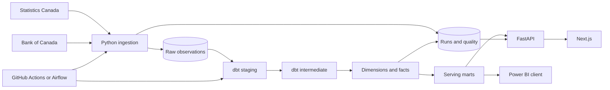

# CanadaPulse architecture

The implemented runtime is a batch data platform. Python downloads and validates official
sources, PostgreSQL stores raw observations and execution metadata, dbt builds the dimensional
warehouse, FastAPI exposes read-only serving models, and Next.js renders the public interface.
The original HTML explorer and its compatible routes remain available at the API root.

Python loading uses temporary COPY tables and natural-key upserts. Per-source session locks
serialize repeats, and source data plus successful metadata commit together. Validation failure
rolls back that source. Model rebuilds are atomic individually; dbt does not provide one global
transaction over the entire graph. Source lineage, successful refresh time and current job
status are shown separately to avoid implying every raw import is already published.

The new public API queries indexed dbt tables, with Pydantic contracts, bounded result sizes,
parameterized filters, query timeouts and read-only transactions. The homepage revalidates
server data every five minutes; browser interaction caches requests and does not retrieve raw
payloads. API and UI deployment are independent, connected by configured origins.

Local runtime: PostgreSQL via Compose, Python API, Next.js. Hosted configuration: PostgreSQL
URL/SSL, API container/PaaS, Next.js/Vercel. Optional Airflow runs in Linux with an authenticated
localhost-only UI. Spark processes an explicitly exported canonical slice and does not replace
the working SQL pipeline. See data-model.md, deployment.md and orchestration.md for details.
