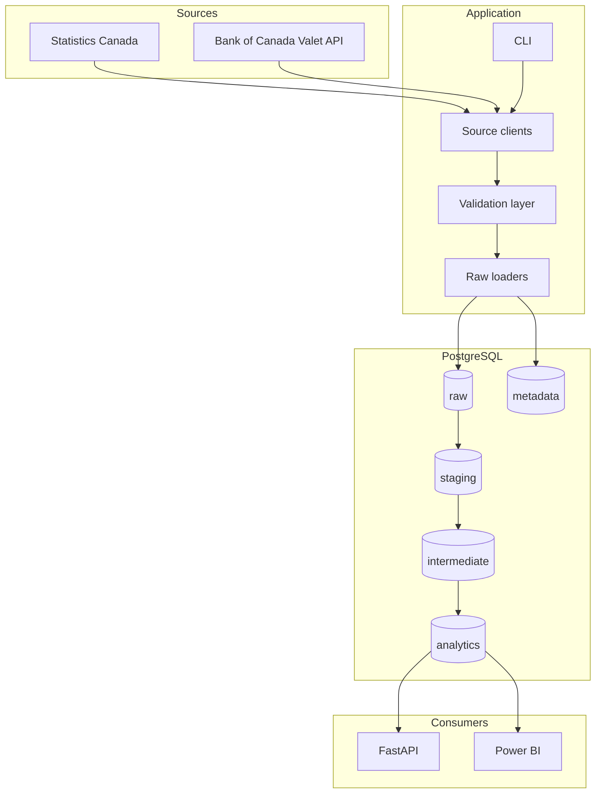

# CanadaPulse Architecture

CanadaPulse follows a layered batch data platform architecture. The local implementation
uses PostgreSQL, Python ingestion, SQL analytics views, FastAPI, and a local browser
dashboard. dbt, Airflow, and Spark remain future extensions.

## System View

## Layer Responsibilities

The ingestion layer talks to external APIs and files, handles retries, parses source
responses, and returns normalized records. It does not own warehouse transformations.

The raw layer stores source-aligned data with traceability fields, load timestamps, source
identifiers, and pipeline run IDs. It is optimized for idempotent loading and lineage.

The current analytics layer uses `analytics.labour_market` and `analytics.interest_rates`
SQL views directly over raw observations. The diagram's staging/intermediate route is the
planned dbt extension, not a dependency of the working dashboard.

The dbt layer will own staging, intermediate, and analytics models. Staging will standardize
types and names. Intermediate models will calculate reusable business logic. Marts will
provide dimensional and dashboard-ready outputs.

The metadata layer records pipeline execution, status, observed counts, rejection counts,
duration, and errors. These values come from runtime execution, not static documentation.

Airflow will orchestrate the pipeline after ingestion and dbt are independently runnable.
DAG files will call reusable application functions.

FastAPI exposes filtered analytics observations, available dimensions, and recent pipeline
runs. A self-contained HTML dashboard uses these read-only endpoints for charts and CSV export.

## Local Runtime

Docker Compose starts PostgreSQL. `python -m canadapulse.cli ingest` runs the batch pipelines;
`python -m canadapulse.cli serve` starts the API and dashboard on localhost port 8000.
