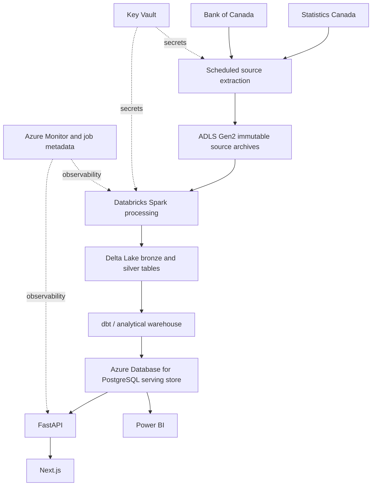

# Optional Azure and Databricks architecture

This is a future deployment option, not a claim that the local project runs on Azure.
No paid Azure service is required for ingestion, dbt, API, tests or the website.

ADLS Gen2 can retain immutable downloads partitioned by source and extraction date. This adds
replayable revision history beyond the current latest-observation raw store. Databricks can
run the optional Spark transformations when additional datasets or a lakehouse environment
justify cluster processing. Delta Lake provides transactional files, schema control and
versioned tables; it does not itself define correct metric grain or seasonal-adjustment rules.

Key Vault should supply workload credentials via managed identities instead of committed
connection strings. Azure Database for PostgreSQL can keep the current serving/API contract;
choose a larger analytical store only after measuring query volume, storage and concurrency.
Monitor jobs, missing source releases, test failures and API errors through Azure Monitor and
the existing application metadata. Keep private endpoints and identity boundaries appropriate
to the actual deployment rather than presenting an unimplemented security guarantee.

A migration must preserve source identities, lineage, null semantics and unit conversion, and
reconcile Spark/Delta results to dbt facts before switching consumers. Cost controls include
job clusters that terminate, sensible file partitions, archive lifecycle rules and measured
refresh frequency. The current dataset does not require a distributed cluster.
