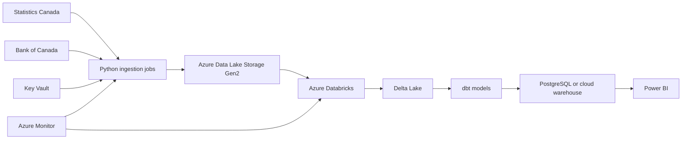

# Future Cloud Architecture

CanadaPulse is local-first. Azure and Databricks are planned as a deployment path, not a
requirement for running the project.

## Components

- Azure Data Lake Storage Gen2 would store raw and curated files for larger historical
  processing.
- Azure Databricks would run Spark transformations when data volume or distributed
  processing needs justify it.
- Delta Lake would provide ACID table storage for lakehouse workflows.
- Azure Database for PostgreSQL or a fit-for-purpose warehouse would serve dbt models and
  API workloads.
- Key Vault would store credentials and connection strings.
- Azure Monitor would collect logs, metrics, and alerts.
- Power BI would consume analytics marts rather than raw source tables.

## Local Parity

The local project keeps source clients, validation, metadata, and SQL modelling portable.
Cloud deployment should change runtime infrastructure, not core business logic.

