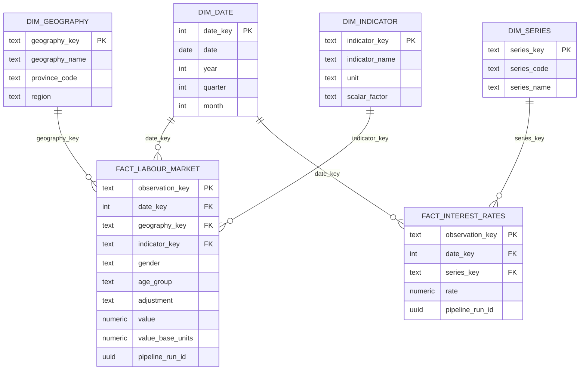

# CanadaPulse data model

## Layers and ownership

Python owns `raw` source observations and `metadata` run history. dbt owns `staging`,
`intermediate`, `warehouse` dimensions/facts, and curated `analytics` tables. Legacy
`analytics.labour_market` and `analytics.interest_rates` views remain for the local MVP.

| Model | Grain and purpose |
|---|---|
| raw.statcan_labour_force | Full-table PID × reference period × vector × coordinate; SHA-256 source_row_hash is the upsert identity |
| raw.bank_of_canada_observations | Observation date × official series code |
| metadata.pipeline_runs | One execution UUID; independently started, atomically completed with data |
| stg_statcan_labour | Same source identity, trimmed labels, typed date/value; source payload remains in raw |
| stg_boc_interest_rates | Daily observation with normalized official series code |
| int_labour_observations | Estimate-only observations plus deterministic dimension keys and base-unit conversion |
| int_interest_rate_observations | Daily rates with date and series keys |
| dim_date | One calendar day covering the loaded source ranges |
| dim_geography | One actually observed geography, enriched from a reference seed |
| dim_indicator | Indicator name × published unit × scalar factor |
| dim_series | One official Bank of Canada series |
| fact_labour_market | Full-table PID × reference period × vector × coordinate |
| fact_interest_rates | Calendar date × official series |
| labour_observations | Full-demographic fact/dimension join for the API explorer |
| interest_rate_history | Daily rate fact with dates and series labels |
| province_labour_summary | Month × geography, total gender, age 15+, seasonally adjusted |
| canada_labour_trends | Canada-only monthly headline summary |
| province_comparison | Province/territory monthly headline summary, identical scope |
| economic_dashboard | Canada headline month with last observed rate in that same month |

## Labour grain

The source identity is verified against a separate business uniqueness test:
reference month × geography × indicator (including unit and scale) × gender × age group
× adjustment × statistical measure. Do not remove gender, age, adjustment, or measure
when joining facts. The current ingestion retains `Estimate` and preserves every loaded
adjustment category. Men+, Women+, and Total - Gender retain source wording. The source
vector and coordinate remain on facts for audits. Suppressed values remain NULL, never zero.

`source_row_hash` excludes revisable values, so repeated loads replace the existing
observation without creating revision duplicates. The store retains the latest observed
revision, not a full version history. Upserts do not delete records missing from later downloads.

## Keys and relationships

Date keys use YYYYMMDD integers. Other dimension keys use MD5 of JSON arrays of natural
key components. JSON field boundaries and null representation avoid concatenation collisions.
These are deterministic surrogate identifiers, not cryptographic security controls.

Facts reference date, geography, indicator, or series keys. dbt unique/not_null/relationships
tests validate keys after each build; PostgreSQL unique indexes enforce dimension uniqueness.
There are no physical foreign-key constraints on rebuilt dbt tables: relationship tests are
an explicit build gate. Fact/source reconciliation protects against accidental row loss/fan-out.

## Units and calculations

Explorer values retain published units. Headline employment/unemployment are persons,
converted from thousands. Percentages are not additive. Rate differences are percentage
points; employment growth percent divides by the exact prior-year month and protects
against zero denominators. MoM uses LAG plus a calendar-month check so a missing month
is not silently treated as adjacent. YoY joins the exact month a year earlier.

The economic mart chooses the last observed policy rate within each reference month,
retains that rate's date, and marks whether the month has ended. Missing months remain
missing; daily and monthly frequencies are never joined merely by identical timestamps.
These aligned trends do not imply causation.

## Materialization and indexes

Staging/intermediate views keep transformations inspectable. Dimension/fact/serving tables
are rebuilt to capture revisions at the measured dataset size. Serving indexes match
geography + indicator + demographics + adjustment + date lookups and date-based comparisons.
Rates use series + date. No raw payloads are copied to the public query models. See
warehouse.md for build and lineage documentation commands.
