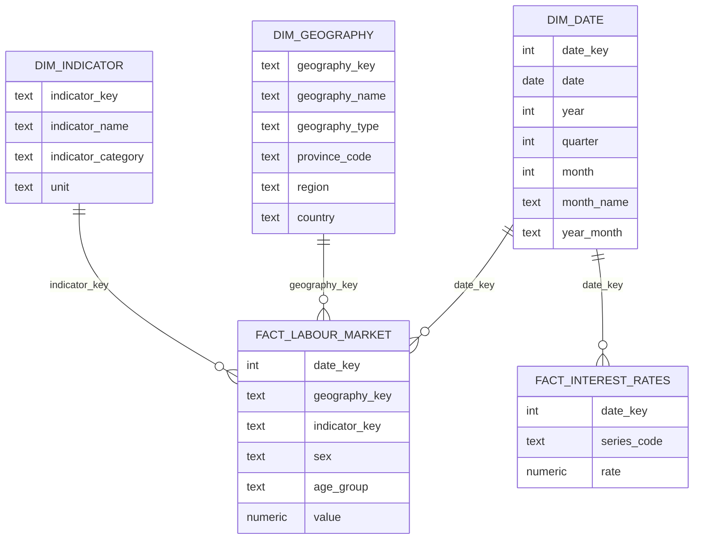

# Data Model

CanadaPulse separates operational raw storage from analytics-ready warehouse models.

## Schemas

- `raw`: source-aligned records loaded by Python ingestion.
- `staging`: dbt-cleaned source models.
- `intermediate`: reusable dbt business logic.
- `analytics`: facts, dimensions, and dashboard-ready marts.
- `metadata`: pipeline execution and observability tables.

## Pipeline Metadata

`metadata.pipeline_runs` has one row per ingestion or pipeline execution.

Important fields:

- `pipeline_run_id`: UUID generated at runtime.
- `pipeline_name`: logical pipeline name.
- `source_name`: source being processed.
- `started_at` and `completed_at`: runtime timestamps.
- `status`: `RUNNING`, `SUCCESS`, `FAILED`, or `PARTIAL`.
- `records_extracted`, `records_loaded`, `records_rejected`: observed counts.
- `duration_seconds`: calculated from actual start and completion times.
- `error_message`: populated on failures.

## Raw Source Grain

`raw.bank_of_canada_observations` uses this natural key:

```text
observation_date x series_code
```

`raw.statcan_labour_force` stores a `source_row_hash` to support idempotent loading while
preserving source details. The implemented identity uses:

```text
full-table PID x reference_period x vector x coordinate
```

The hash excludes values so revisions update the existing observation. The full-table PID is
`14100287`; the configured display-table reference is a slice of this source. `sex` stores the
source Gender label (including Men+, Women+, Total - Gender). `data_type` stores seasonal
adjustment. Original units, scaling, status flags, and JSON payloads remain available.

## Implemented Analytics Views

`analytics.labour_market` exposes monthly Estimate observations with date, geography,
indicator, gender, age group, adjustment, value, unit, scaling, source status, and lineage.
The dashboard selects each dimension explicitly and does not aggregate distinct series.

`analytics.interest_rates` exposes daily dates, series identifiers, rates, and lineage.
The views are immediately consistent with successful ingestion commits. Missing labour
observations remain null. The following star schema remains planned, not implemented.

## Planned Star Schema



## Index Choices

The raw labour table is indexed by reference date, geography, and vector/date because
downstream transformations and APIs will commonly filter by time, province, and source
series. Bank of Canada observations are indexed by series and descending date for latest-rate
queries and time-series endpoints.
